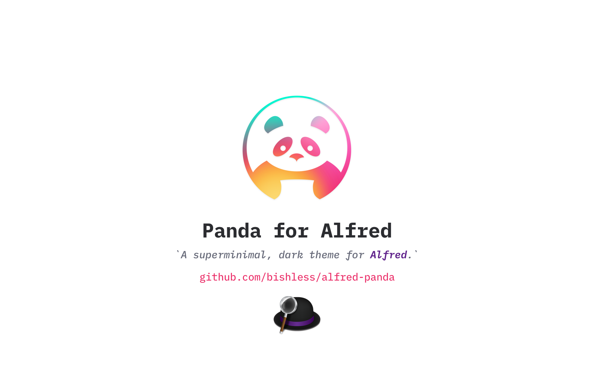

Based on [@PandaTheme](https://github.com/PandaTheme), a _Superminimal_, _dark_ theme family by [@siamak](http://github.com/Siamak). It's a _dark_ theme crafted especially for [Alfred.app](https://www.alfredapp.com/), with subtle colors that are meant to be easy on the eyes.

---

---

## ⌨️ How to Use
1. Download and extract [.zip](https://github.com/bishless/alfred-panda/archive/master.zip) file.
1. Double-click **Panda.alfredappearance** to add theme to Alfred.app's _Appearance_ pane.
1. Click the `Import` button when prompted.

## 🐼 About Pandas

1. Sleep 12-14 hours per day
2. Eat 12-14 hours per day
3. Consume 10 to 18 kilos of raw bamboo per day
4. Poop 10 to 18 kilos of processed bamboo per day.
5. Panda sex is awkward. Naps are much more fun.

> Picture & Contents from: https://dribbble.com/shots/2354579-Panda-Icon-Party.
